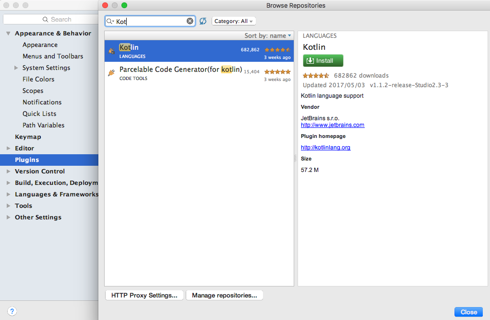
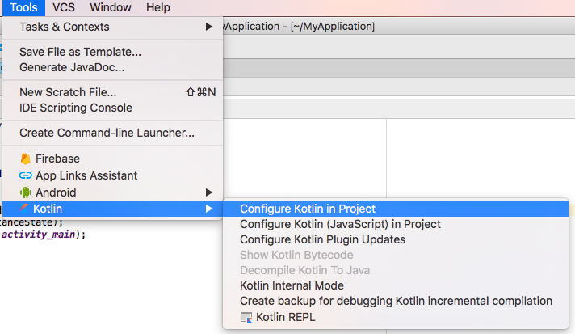
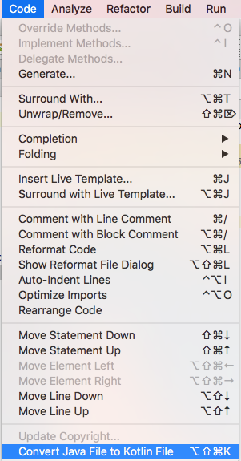
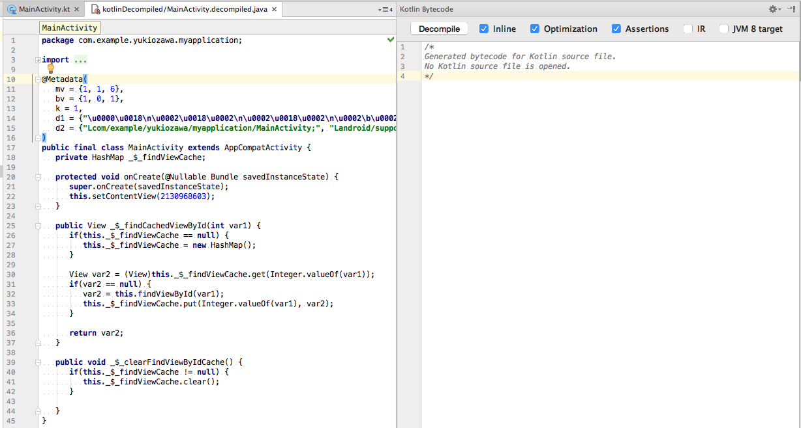
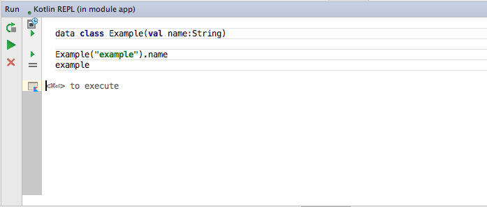

# Kotlin 勉強会
<!-- -- id="page2" -->
#### 第一回
#### 2017年5月26日

---

## アジェンダ
<!-- -- id="page2" -->

1. [AndroidStudioの設定](#/page3)
2. [Kotlin基礎](#/page9)
3. [Kotlin koans](#/page17)
4. [参考サイト](#/page18)

---

## AndroidStudioの設定
<!-- -- id="page3" -->

---

## pluginをinstallする
<!-- -- id="page4" -->

>>>

### Preferences > Plugins > Browserepositories > Kotlin


---

## プロジェクトにKotlinを設定する
<!-- -- id="page5" -->

>>>

### Tools > Kotlin > Configure Kotlin in Project


>>>

この辺が自動で追加されます

build.gradle
```Gradle
buildscript {
    ext.kotlin_version = '1.1.2-4'
    dependencies {
        ...
        classpath "org.jetbrains.kotlin:kotlin-gradle-plugin:$kotlin_version"
    }
}
```

app/build.gradle
```Gradle
apply plugin: 'kotlin-android'
dependencies {
    ...
    compile "org.jetbrains.kotlin:kotlin-stdlib-jre7:$kotlin_version"
}
```

>>>

Data Bindingを有効にするためには下記も入れます
(今回はやらない)

app/build.gradle
```Gradle
apply plugin: 'kotlin-kapt'
dependencies {
    ...
    kapt 'com.android.databinding:compiler:2.3.1'
}
```


---

## Java -> Kotlin 変換を行う
<!-- -- id="page6" -->

>>>

### Code > Convert Java File to Kotlin File


>>>

こんな感じに変換されます
```java
public class MainActivity extends AppCompatActivity {

    @Override
    protected void onCreate(Bundle savedInstanceState) {
        super.onCreate(savedInstanceState);
        setContentView(R.layout.activity_main);
    }
}
```

## ↓

```Kotlin
class MainActivity : AppCompatActivity() {

    override fun onCreate(savedInstanceState: Bundle?) {
        super.onCreate(savedInstanceState)
        setContentView(R.layout.activity_main)
    }
}

```

---

## Javaのコードを確認する
<!-- -- id="page7" -->

>>>

### Tools > Kotlin > Show Kotlin ByteCode > Decompile

Javaのコードを確認することで理解が深まるはず




---

## REPL
<!-- -- id="page8" -->

>>>

### Tools > Kotlin > Kotlin REPL

単純なコードを試したい時に便利




---

## Kotlin基礎
<!-- -- id="page9" -->

リファレンス

https://kotlinlang.org/docs/reference/

---

### valとvar
<!-- -- id="page10" -->

>>>

- valは変更不可
- varは変更可能

```
    val imutable = "imutable"
    var mutable = "mutable"
```

>>>

Javaにdecompileすると

- val=final
- setter getterも作成されている

```Java
   @NotNull
   private final String imutable = "imutable";
   @NotNull
   private String mutable = "mutable";

   @NotNull
   public final String getImutable() {
      return this.imutable;
   }

   @NotNull
   public final String getMutable() {
      return this.mutable;
   }

   public final void setMutable(@NotNull String var1) {
      Intrinsics.checkParameterIsNotNull(var1, "<set-?>");
      this.mutable = var1;
   }
```

---

## Nullable
<!-- -- id="page11" -->

>>>

型の後ろに?をつけるとNullableとなる

```
    val nonNull: String = null // コンパイルエラー
    val nullable: String? = null
```

>>>


Javaの時はアノテーションで警告を出してたりしたと思います
```
   @NotNull
   private String nonNull;
   @Nullable
   private String nullable;
```

---

## 関数
<!-- -- id="page12" -->

>>>

fun メソッド名(引数): 返却型
```
    fun plus(i: Int, i2: Int): Int {
        return i + i2
    }
```

省略した書き方もできます
```
    // 返却値なしはUnit
    fun plusPrint(i: Int, i2: Int): Unit {
        print(i + i2)
    }

    // 1行の場合は括弧は省略できる
    fun minus(i: Int, i2: Int): Int = i - i2

    // 返却値なしかつ1行はもっと省略できる
    fun minusPrint(i: Int, i2: Int) = print(i - i2)
```

>>>

Javaにdecompileすると
```Java
   public final int plus(int i, int i2) {
      return i + i2;
   }
```

---

## Class
<!-- -- id="page13" -->

>>>

```
// プライマリコンストラクタの宣言とヘッダーに書ける
class Example(test:String) {
    var test : String

    init {
        // 初期化
        this.test = test
    }
}
```

もっと簡潔にプロパティも同時に宣言することができます
```
// プライマリコンストラクタの宣言とプロパティがヘッダーに書ける
class Example(var test:String)
```

>>>

Javaにdecompileすると
```Java
public final class Example {
   @NotNull
   private String test;

   @NotNull
   public final String getTest() {
      return this.test;
   }

   public final void setTest(@NotNull String var1) {
      Intrinsics.checkParameterIsNotNull(var1, "<set-?>");
      this.test = var1;
   }

   public Example(@NotNull String test) {
      Intrinsics.checkParameterIsNotNull(test, "test");
      super();
      this.test = test;
   }
}
```


---

## Data Class
<!-- -- id="page14" -->

>>>

- dataクラスにすると下記が生成されます
    - equals()/ hashCode() のペア
    - toString()
    - 宣言した順番でプロパティに対応する componentN() 関数
    - copy() 関数

```
data class Data(val id: Int, val name: String)

```

---

## Companion Objects
<!-- -- id="page15" -->

>>>

Javaのstaticメソッドの代替として使用できます
```
class Example {
    companion object {
        fun companionFunction(): String {
            return "companionFunction"
        }
    }
}    
```

呼び出しは下記のような形です
```
Example.companionFunction()
```

>>>

Javaにdecompileすると
```Java
public final class Example {
   public static final class Companion {
      @NotNull
      public final String companionFunction() {
         return "companionFunction";
      }

      private Companion() {
      }

      // $FF: synthetic method
      public Companion(DefaultConstructorMarker $constructor_marker) {
         this();
      }
   }
}
```

呼び出しは下記のような形です
```
Example.Companion.companionFunction();
```

---

## シングルトン
<!-- -- id="page16" -->

>>>

シングルトンを容易に宣言できます

```
object Singleton {
    fun singletonFunction(): String {
        return "singletonFunction"
    }
}
```

呼び出しは下記のような形です
```
Singleton.singletonFunction()
```

>>>

Javaにdecompileすると

```Java
public final class Singleton {
   public static final Singleton INSTANCE;

   @NotNull
   public final String singletonFunction() {
      return "singletonFunction";
   }

   private Singleton() {
      INSTANCE = (Singleton)this;
   }

   static {
      new Singleton();
   }
}
```

呼び出しは下記のような形です
```
Singleton.INSTANCE.singletonFunction();
```

---

## Kotlin koans
<!-- -- id="page17" -->

https://try.kotlinlang.org/

お題に対して解答コードを書いてチェックできる

初めはここで学習するのが良さそう


---

## 参考サイト
<!-- -- id="page18" -->

- Reference
    - https://kotlinlang.org/docs/reference/

- Reference(日本語訳)
    - https://dogwood008.github.io/kotlin-web-site-ja/docs/reference/properties.html

- ３０分で覚えるKotlin文法
    - http://qiita.com/k5n/items/cc0377b75d8537ef8a85
